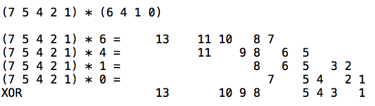
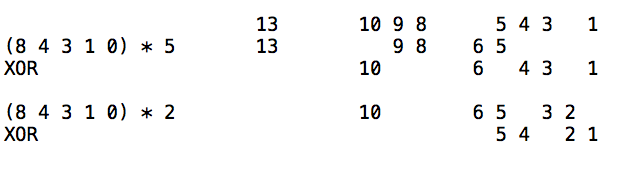
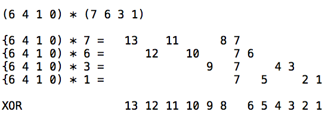
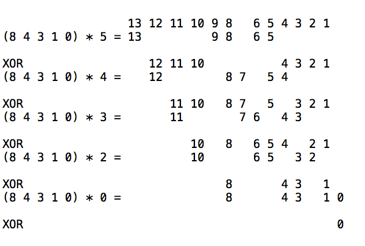
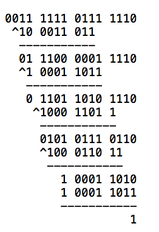

#### Galois field

We are going to construct a finite Galois field.

There will be 256 elements in the field, the same as the different values for a single byte.

The addition operation will be XOR.

The multiplication operation will be:

- left-shift by ``1`` for multiplication by 2
- left-shift by ``2`` for multiplication by 4

and so on.  To multiply by 3 = 2 + 1

- left-shift by ``1`` and XOR the result with self

There are several ways of thinking about this and we'll look at them in turn.  

Kak starts with polynomial arithmetic.  Here's another approach.

#### Wagner

The [Wagner](http://www.cs.utsa.edu/~wagner/laws/FFM.html) source provides a different perspective and gives some additional insight.

Consider this multiplication: 

``0xb6 * 0x53``.  

We can write it in binary as:

``1011 0110 * 0101 0011``

We adopt a new notation.  Rewrite this as

```
(7 5 4 2 1) * (6 4 1 0)}
```

This is a shorthand version of the polynomial notation:

``(x^7 + x^5 + x^4 + x^2 + x) * (x^6 + x^4 + x + 1)``

You can do the problem as a x b or b x a, let's leave it as it is:

```
(7 5 4 2 1) * (6 4 1 0)
```

The first thing we do is add uniform spacing:

```
7 - 5 4 - 2 1 -
```

But make it invisible

```
7   5 4   2 1
```

Then multiply by ``6`` by left-shifting that many places

```
13    11 10   8 7
```

Do the ``4`` in  ``(6 4 1 0)`` and then the ``1`` and the ``0`` (remembering that ``0`` means ``1`` shifted left by zero units) and line them all up

```
13    11 10   8 7
      11    9 8   6 5
              8   6 5   3 2
                7   5 4   2 1
```

Now XOR each place (**no carry**):

```
13    11 10   8 7
      11    9 8   6 5
              8   6 5   3 2
                7   5 4   2 1
--------------------------------
13       10 9 8     5 4 3   1
```

I made a figure previously:



In the line ``7 5 4 2 1) * 6``, we simply add ``6`` to each of the digits in the first number to give the result ``(13,11,10,8,7)``.  The spacing is used to simplify the XOR on the last line.

#### Mod keeps things finite

Now, we do the mod operation.



The special divisor is ``(8,4,3,1,0)``. We leave aside the question of why this works, for now.  It is sometimes called "the irreducible polynomial".  

In the polynomial notation it is

```
(x^8 + x^4 + x^3 + x + 1)
```

For now, just know that we are going to divide by it.

The way this is done is to multiply the special divisor by a chosen value, and then subtract it from the interim result.  

Just as multiplication is repeated addition, division is repeated subtraction, which is carried out here in stages.

We multiply by ``(8,4,3,1,0)`` by ``5`` to get it to align with the ``13`` in the interim result.  

```
13       10 9 8     5 4 3   1
13          9 8   6 5
-------------------------------
         10       6   4 3   1
```


This is the same as multiplying the irreducible polynomial by ``x^5`` or multiplying its binary equivalent (1 0001 1011) by ``2^5``.

After the XOR, the ``13`` is gone.  We repeat the process, lining up with the ``10`` and zeroing it out. 

```
10       6   4 3   1
10       6 5   3 2
--------------------
           5 4   2 1
```

If there had been an ``8`` we would go that far, but no farther.

Our answer, then, is ``0011 0110`` which is equal to ``0x36``.

The complete multiplication is:

- ``0xb6 * 0x53 = 0x36``


Effectively what we've done is to do repeated divisions by powers of two of the super duper special number (1 0001 1011).  We guarantee that every place higher than $8$ will be turned to zero by this operation.

#### wikipedia example

Another view of the modulus or division operation comes from the wikipedia example:  ``0x53 * 0xca``.  

Write this in binary:  

``0101 0011 * 1100 1010``

In our new notation, this would be



which looks like it's pretty special.  And it is. 

Here is the mod step:
 


Remember, that ``0`` at the end is not really zero.  

It is a power of ``2``, namely ``2^0 = 1`` 

What we've shown is that  ``0x53 * 0xca = 0x01``.  In other words, ``0x53`` is the *multiplicative inverse* of ``0xca``.

Let's take a look at doing the same mod operation as long division, which should hammer home the point we've been absorbing.



#### The trick

Why is ``1 0011 1011`` special?  Ignoring the high bit, this is equal to 27 decimal and ``3b`` hex.

Choose any number in the range 0-255 except 0, and for any of these multiply that number by any number in the range 0-255.  The resulting set is exactly 0-255.  In particular, every number has a unique multiplicative inverse in this field, using the **mod** trick.
