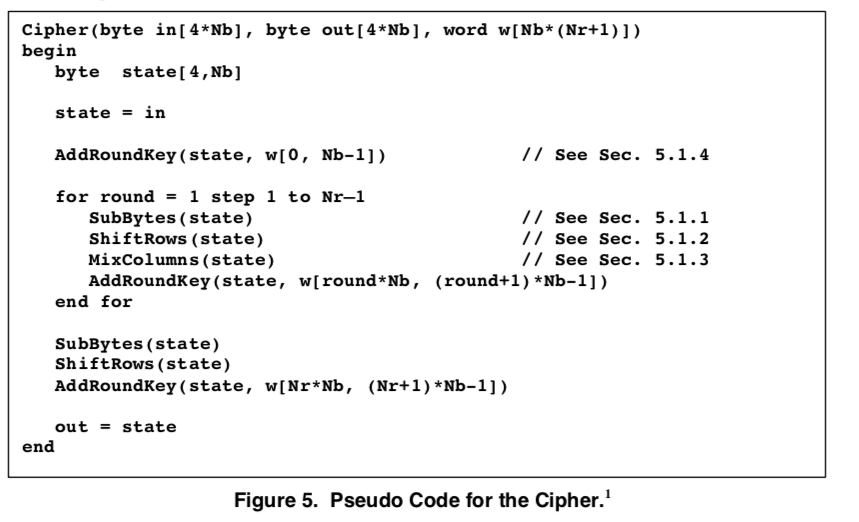

#### AES encryption and decryption

I did a complete overhaul of the pages about math for AES, but I haven't done new write-ups about the steps in encryption and decryption.  The old explanations are still fine and to honest the best place to start is the official U.S. government document in sources.

I rewrote all the code.  It's in ``pyaes``.  It could be better organized, perhaps.

In any event, I can generate the output from [this source](sources/AES.pdf) and also ``decrypt(encrypt(p))`` gives p again.

The old pages are:

- [part 1](pages-old/AES1-Intro.md)
- [part 2](../AES-math/README.old.md)
- [part 3](pages-old/AES3-key.md)
- [part 4](pages-old/AES4-encrypt.md)

The old code is also fine.  A major difference:  the 16 bytes are organized as 4-byte words, and there's a lot of back and forth formatting.  The new code follows the CryptoPals advice:  stick with arrays of integers [0-255].

I did write a new page on 

- [key expansion](pages/key-expansion.md)
